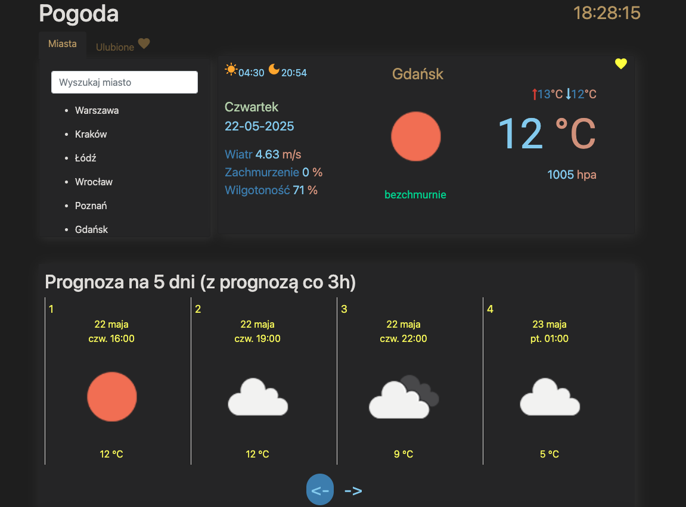

# WeatherAppAngularClient

> ⚠️ **Note:** This is a legacy project built with Angular CLI version 8.3.21.  
> If you're using Node.js version 17 or higher, run the app with the following command to avoid cryptographic errors:
>
> ```bash
> NODE_OPTIONS=--openssl-legacy-provider ng serve
> ```

## Description

This application allows users to check the current weather and a 5-day forecast for selected cities in Poland.  
It retrieves weather data using the [OpenWeatherMap API](https://openweathermap.org/api).

> 🔗 Live Demo: [https://weather-app-angular-9782ae5f8a74.herokuapp.com/](https://weather-app-angular-9782ae5f8a74.herokuapp.com/)

### 📸 Main Screen



## 🧪 Technologies

- Angular
- TypeScript
- HTML, CSS, Bootstrap
- OpenWeather Heroku

## Development Server

Run:

```bash
NODE_OPTIONS=--openssl-legacy-provider ng serve
```
